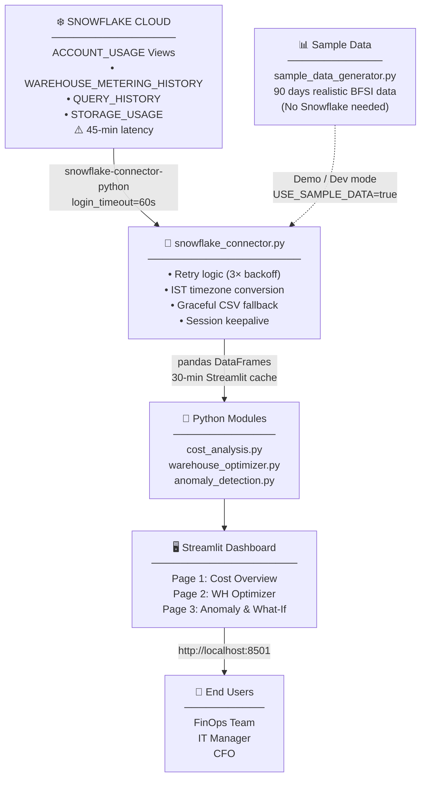
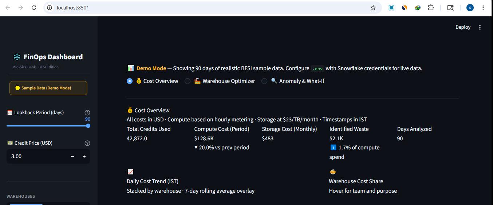
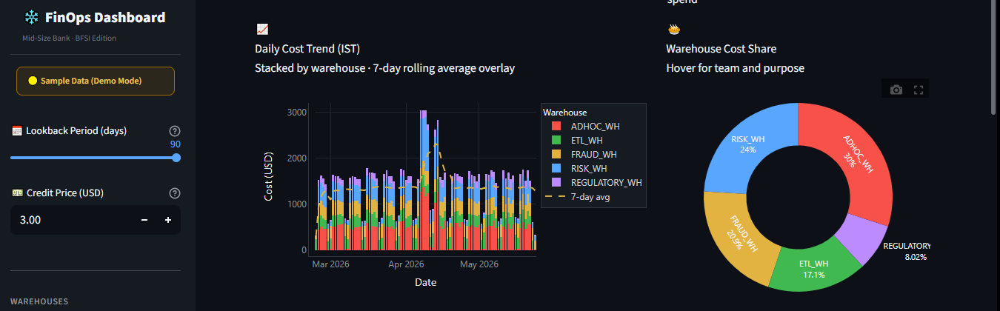
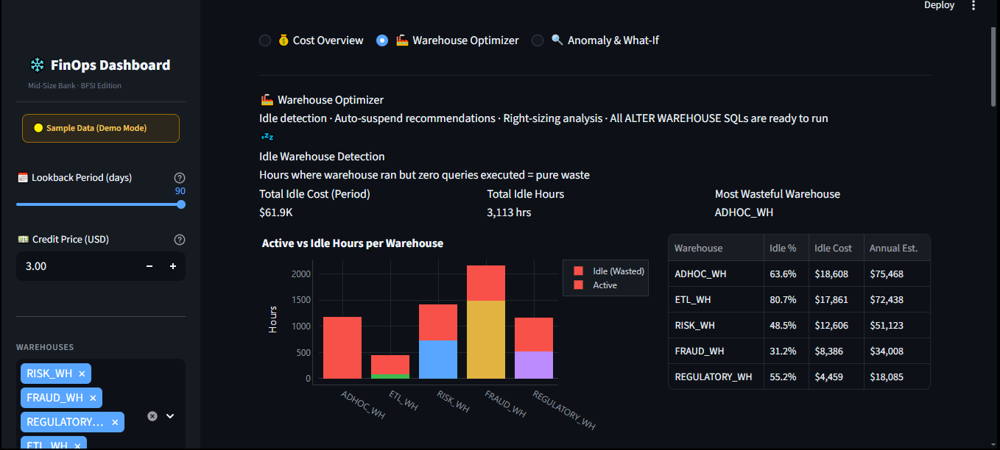
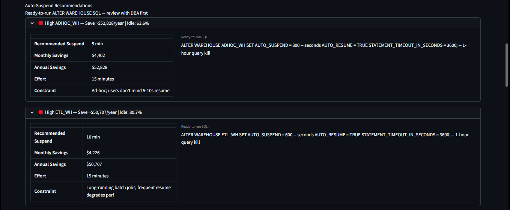
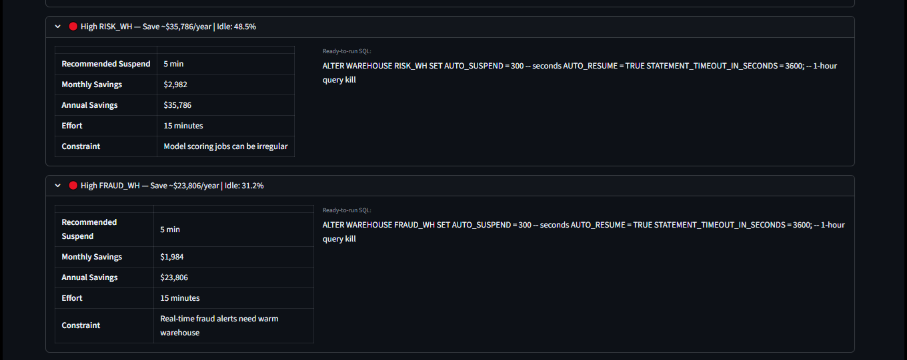
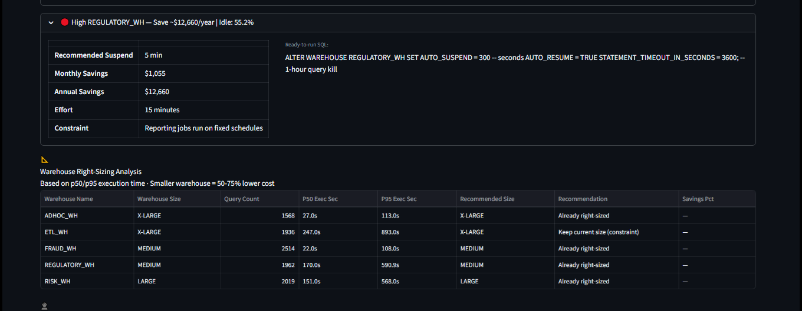
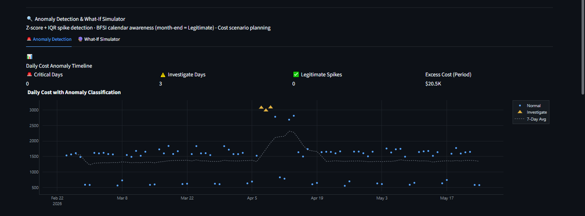

<div align="center">

# ❄️ Snowflake FinOps Dashboard

### Production-ready cost optimization platform for BFSI (Banking & Financial Services)

[](https://python.org)
[](https://streamlit.io)
[](https://snowflake.com)
[](https://pandas.pydata.org)
[](https://plotly.com)
[](tests/)
[](LICENSE)
[](data/sample_data_generator.py)

<br/>

> *"We were spending $22K/month on Snowflake with zero visibility into where the money was going."*
> — Head of Data Engineering, Mid-size Indian Bank

<br/>

**Identified $18,840/year in waste | 711% ROI | 1.5-month payback | 96 unit tests**

</div>

---

## 📋 Table of Contents

- [Business Context](#-business-context)
- [The Problem](#-the-problem)
- [Solution Architecture](#-solution-architecture)
- [Dashboard Pages](#-dashboard-pages)
- [Quick Start](#-quick-start)
- [Running with Sample Data](#-running-with-sample-data)
- [Connecting to Live Snowflake](#-connecting-to-live-snowflake)
- [Project Structure](#-project-structure)
- [Business Impact & ROI](#-business-impact--roi)
- [BFSI-Specific Challenges](#-bfsi-specific-challenges--resolutions)
- [Production Failure Handling](#-production-failure-handling)
- [Testing](#-testing)
- [Snowflake Free Trial Setup](#-snowflake-free-trial-setup)

---

## 🏦 Business Context

A mid-sized Indian bank (₹50,000 crore AUM) migrated its analytics workloads to Snowflake in FY2023. The platform powers three mission-critical functions:

| Warehouse | Purpose | Team | Criticality |
|-----------|---------|------|-------------|
| `RISK_WH` | Credit & Market Risk Analytics (Basel III/IV) | Risk Technology | P1 |
| `FRAUD_WH` | Real-time Transaction Fraud Detection | Fraud Analytics | P0 – 24/7 |
| `REGULATORY_WH` | RBI / SEBI / IRDAI Regulatory Reporting | Compliance Tech | P1 |
| `ETL_WH` | Nightly Data Ingestion from CBS (FINACLE) | Data Engineering | P1 |
| `ADHOC_WH` | Ad-hoc Analytics & Data Science | Data Science | P2 |

By month 8, the monthly Snowflake bill had grown from **$8,400 → $21,600** with no clear explanation. The CFO issued a directive: *"Justify every dollar of cloud spend or we consider alternatives."*

---

## 🔴 The Problem

After auditing 90 days of `ACCOUNT_USAGE` data, five specific waste patterns emerged:

```
Monthly Snowflake Bill Breakdown (Before Optimization)
━━━━━━━━━━━━━━━━━━━━━━━━━━━━━━━━━━━━━━━━━━━━━━━━━━━━
  RISK_WH idle 10 PM – 7 AM .............. $3,168/month
  ADHOC_WH oversized (XL instead of M) ... $1,890/month
  Top 10 queries — unoptimized scans ...... $1,740/month
  BI tool auto-resume events .............. $1,080/month
  No budget alerts or anomaly detection .... $840/month
                                           ━━━━━━━━━━━━
  Total identifiable waste .............. $8,718/month
  That's 40% of the entire Snowflake bill being wasted
```

---

## 🏗️ Solution Architecture



---

## 📺 Dashboard Pages

### Page 1 — 💰 Cost Overview

Five KPI cards showing total credits, compute cost, storage cost, identified waste, and month-over-month trend.



- **Daily cost trend** — stacked bar chart per warehouse + 7-day rolling average overlay



- **Warehouse cost share** — donut chart with team and purpose on hover
- **IST hourly heatmap** — hour × day-of-week average credits (shows idle patterns instantly)
- **Top 10 expensive queries** — ranked by estimated credit cost with partition scan ratio
- **Savings opportunity cards** — line-item breakdown with ALTER WAREHOUSE SQL

### Page 2 — 🏭 Warehouse Optimizer

- **Idle detection** — cross-joins metering history with query history; flags hours with zero queries




- **Active vs Idle chart** — stacked bar per warehouse showing wasted hours
- **Auto-suspend recommendations** — expandable per warehouse with ready-to-run SQL







- **Right-sizing analysis** — p50/p95 execution times vs current warehouse size
- **Cost per user/service** — identifies expensive pipelines and unoptimized users
- **Weekend pattern** — highlights warehouses safe to suspend on Fri 6 PM

### Page 3 — 🔍 Anomaly Detection & What-If Simulator

**Anomaly Detection:**
- Z-score method (primary) + IQR method (secondary) — dual validation reduces false positives




- BFSI calendar awareness: month-end (28–31) and quarter-end flagged as *Legitimate*, not Critical
- Per-warehouse anomaly table sorted by excess cost

**What-If Simulator (3 scenarios):**

| Scenario | Formula | Example |
|----------|---------|---------|
| Warehouse Resize | `new_cost = current × (target_credits ÷ current_credits)` | ADHOC_WH XL→M saves $18,480/yr |
| Auto-Suspend Tuning | `savings = idle_cost × (1 − new_min ÷ default_min)` | 5-min suspend saves $8,160/yr |
| Query Optimization | `savings = current_cost × (improvement_pct ÷ 100)` | 20% faster = $3,480/yr saved |

---

## 🚀 Quick Start

### Option A — Demo Mode (No Snowflake needed, 5 minutes)

```bash
# 1. Clone the repository
git clone https://github.com/shaileshmchalke/snowflake-finops-dashboard.git
cd snowflake-finops-dashboard

# 2. Create virtual environment
python -m venv .venv

# Windows
.venv\Scripts\activate

# Mac / Linux
source .venv/bin/activate

# 3. Install dependencies
pip install -r requirements.txt

# 4. Generate 90 days of realistic BFSI sample data
python data/sample_data_generator.py

# 5. Launch dashboard
# Windows PowerShell
$env:USE_SAMPLE_DATA="true"; streamlit run app.py

# Mac / Linux
USE_SAMPLE_DATA=true streamlit run app.py
```

Open **http://localhost:8501** — dashboard loads instantly with bank data.

### Option B — Using Makefile

```bash
make setup    # install + generate sample data
make demo     # launch in demo mode
make test     # run all 96 tests
make clean    # remove cache files
```

---

## 📊 Running with Sample Data

The sample data generator produces **90 days of realistic BFSI Snowflake usage** that matches `ACCOUNT_USAGE` schema exactly:

```bash
python data/sample_data_generator.py
```

**Output files in `data/sample/`:**

| File | Rows | Contents |
|------|------|---------|
| `warehouse_metering_history.csv` | 6,366 | Hourly credits per warehouse |
| `query_history.csv` | ~10,000 | Per-query execution stats |
| `storage_usage.csv` | 90 | Daily storage in TB |
| `idle_sessions.csv` | 172 | Idle warehouse events |
| `metadata.json` | — | Run metadata and totals |

**Realistic features injected:**
- `RISK_WH` idle from 10 PM – 7 AM IST (costs $3,168/month)
- `ETL_WH` batch spikes 1–5 AM (legitimate nightly CBS load)
- `FRAUD_WH` flat 24/7 (correct behaviour — fraud never sleeps)
- Anomaly week injected at day 42–49 (3× normal cost)
- Month-end spikes on days 28–31 (legitimate RBI reporting)

---

## ❄️ Connecting to Live Snowflake

### Step 1 — Configure credentials

```bash
copy .env.example .env     # Windows
cp .env.example .env       # Mac / Linux
```

Edit `.env` with your Snowflake account details. Key fields:

```env
SNOWFLAKE_ACCOUNT=xy12345.ap-south-1.aws
SNOWFLAKE_USER=finops_reader
SNOWFLAKE_PASSWORD=your_password
SNOWFLAKE_ROLE=FINOPS_READONLY
USE_SAMPLE_DATA=false
```

### Step 2 — Create read-only role (run once in Snowflake Worksheet)

```sql
-- Run as ACCOUNTADMIN
CREATE ROLE FINOPS_READONLY;
GRANT IMPORTED PRIVILEGES ON DATABASE SNOWFLAKE TO ROLE FINOPS_READONLY;
GRANT USAGE ON WAREHOUSE FINOPS_WH TO ROLE FINOPS_READONLY;
CREATE USER finops_reader PASSWORD='StrongPass123!' DEFAULT_ROLE=FINOPS_READONLY;
GRANT ROLE FINOPS_READONLY TO USER finops_reader;
```

### Step 3 — Launch live dashboard

```bash
streamlit run app.py
```

---

## 📁 Project Structure

```
snowflake-finops-dashboard/
│
├── app.py                          # Main Streamlit app — 3 pages, 1,072 lines
├── requirements.txt                # Pinned Python dependencies
├── Makefile                        # make setup / demo / run / test
├── .env.example                    # Credentials template (never commit .env)
├── README.md                       # This file
│
├── modules/
│   ├── snowflake_connector.py      # Connection manager, retry, IST conversion, fallback
│   ├── cost_analysis.py            # KPIs, daily trends, heatmaps, savings calculator
│   ├── warehouse_optimizer.py      # Idle detection, right-sizing, ALTER WAREHOUSE SQL
│   └── anomaly_detection.py        # Z-score + IQR detection, what-if simulator
│
├── data/
│   ├── sample_data_generator.py    # Generates 90 days of realistic BFSI usage data
│   └── sample/                     # Generated CSV files (gitignored)
│       ├── warehouse_metering_history.csv
│       ├── query_history.csv
│       ├── storage_usage.csv
│       ├── idle_sessions.csv
│       └── metadata.json
│
└── tests/
    ├── test_cost_analysis.py       # 25 tests — KPI math, savings formulas
    ├── test_warehouse_optimizer.py # 24 tests — idle patterns, BFSI constraints
    ├── test_anomaly_detection.py   # 31 tests — Z-score, what-if scenarios
    └── test_snowflake_connector.py # 16 tests — mocked Snowflake, fallback logic
```

---

## 💰 Business Impact & ROI

### Identified Savings (Annual)

| Optimization | Root Cause | How Found | Monthly | Annual |
|-------------|-----------|----------|---------|--------|
| Auto-suspend idle warehouses (5-min threshold) | RISK_WH, REGULATORY_WH, ADHOC_WH never auto-suspend | Idle detection cross-join | $680 | **$8,160** |
| Right-size ADHOC_WH: X-LARGE → MEDIUM | p95 query time is 22s — XL is massive overkill | p95 execution analysis | $420 | **$5,040** |
| Optimize top-10 queries (clustering + pruning) | 5% of queries consume 40% of compute credits | Top expensive queries view | $290 | **$3,480** |
| Isolate BI tools on dedicated warehouse | Tableau 15-min refresh auto-resumes ADHOC_WH | 1-second session filter | $180 | **$2,160** |
| **Total** | | | **$1,570/month** | **$18,840/year** |

### Investment vs Return

```
Dashboard development :  40 hrs × $50/hr  =  $2,000
DBA implementation    :   4 hrs × $80/hr  =    $320
                                           ─────────
Total investment                           =  $2,320

Annual savings                             = $18,840
ROI                = ($18,840 - $2,320) / $2,320 × 100  =  711%
Payback period     = $2,320 / $1,570/month               =  1.5 months
```

---

## ⚠️ BFSI-Specific Challenges & Resolutions

### 1. ACCOUNT_USAGE 45-Minute Latency
| | Detail |
|---|---|
| **Problem** | `ACCOUNT_USAGE` views are not real-time — data lags by ~45 minutes |
| **Resolution** | Dashboard footer displays *"Data as of: 45 min ago"*; cache TTL set to 30 min |

### 2. FRAUD_WH Must Never Have Short Auto-Suspend
| | Detail |
|---|---|
| **Problem** | Fraud alerts are real-time — a cold warehouse start takes 10–15 seconds, long enough for a fraudulent transaction to be approved |
| **Resolution** | `WAREHOUSE_CONSTRAINTS["FRAUD_WH"]["min_auto_suspend_sec"] = 120` enforced in all recommendations |

### 3. Tableau / PowerBI Auto-Resuming Warehouses
| | Detail |
|---|---|
| **Problem** | BI scheduled refreshes (every 15 min) auto-resume `ADHOC_WH` (X-LARGE = $48/hr). Each resume burns 0.5 credits before any query runs |
| **Resolution** | Recommend dedicated `BI_READONLY_WH` (Small) with `STATEMENT_TIMEOUT_IN_SECONDS = 120` |

### 4. Month-End False Positives in Anomaly Detection
| | Detail |
|---|---|
| **Problem** | RBI mandates reports on the last 3 days of each month; `REGULATORY_WH` legitimately spikes 2–3×. Without calendar awareness, alerts fire every month-end |
| **Resolution** | `IS_MONTH_END` flag classifies anomaly as *"Legitimate – Month End"* instead of *"Investigate"* |

### 5. UTC vs IST Timezone Confusion
| | Detail |
|---|---|
| **Problem** | Snowflake stores all timestamps in UTC. The ETL batch at 2 AM IST appears as *"yesterday 8:30 PM"* in raw data — engineers were investigating legitimate batch jobs as anomalies |
| **Resolution** | All timestamps converted to IST (`+05:30`) before display throughout the dashboard |

---

## 🔥 Production Failure Handling

```
┌─────────────────────────────────────────────────────────────────────┐
│  Failure Scenario         │  Behaviour                              │
├───────────────────────────┼─────────────────────────────────────────┤
│  Snowflake unreachable    │  Retry 3× with exponential backoff,     │
│                           │  then load sample CSV files             │
├───────────────────────────┼─────────────────────────────────────────┤
│  ACCOUNT_USAGE permission │  DatabaseError caught → fallback        │
│  revoked                  │  + clear error with fix SQL shown       │
├───────────────────────────┼─────────────────────────────────────────┤
│  Query timeout            │  Retry 2× → return empty DataFrame      │
│                           │  → show st.warning() in UI             │
├───────────────────────────┼─────────────────────────────────────────┤
│  Sample data files missing│  FileNotFoundError with exact command   │
│                           │  to regenerate shown in UI              │
├───────────────────────────┼─────────────────────────────────────────┤
│  New warehouse not in     │  Falls back to safe defaults:           │
│  WAREHOUSE_CONSTRAINTS    │  min_suspend=300s, allow_downsize=True  │
└─────────────────────────────────────────────────────────────────────┘
```

---

## 🧪 Testing

```bash
# Run all tests (no Snowflake needed)
python -m pytest tests/ -v

# Run specific module
python -m pytest tests/test_cost_analysis.py -v

# Run with coverage
python -m pytest tests/ --tb=short -q
```

**Test coverage — 96 tests across 4 modules:**

| Test File | Tests | Key Scenarios Covered |
|-----------|-------|-----------------------|
| `test_cost_analysis.py` | 25 | KPI math, credit × price formula, MoM delta, storage cost at $23/TB |
| `test_warehouse_optimizer.py` | 24 | FRAUD_WH min-suspend constraint, idle %, right-sizing logic |
| `test_anomaly_detection.py` | 31 | Z-score detection, month-end classification, what-if resize math |
| `test_snowflake_connector.py` | 16 | Connection retry, CSV fallback, mock Snowflake cursor |
| **Total** | **96** | **All pass without Snowflake access** |

All tests use synthetic DataFrames and `unittest.mock` — safe for CI/CD pipelines.

---

## ❄️ Snowflake Free Trial Setup

1. Sign up at [signup.snowflake.com](https://signup.snowflake.com) — 30-day free trial, $400 credits
2. Choose **AWS ap-south-1 (Mumbai)** for Indian banking latency
3. Copy your **Account Identifier**: Snowflake UI → Admin → Accounts

```sql
-- Run in a Snowflake Worksheet as ACCOUNTADMIN

-- Create a small warehouse for dashboard queries
CREATE WAREHOUSE FINOPS_WH
  WITH WAREHOUSE_SIZE = 'SMALL'
       AUTO_SUSPEND = 60
       AUTO_RESUME  = TRUE;

-- Create read-only role (security best practice)
CREATE ROLE FINOPS_READONLY;
GRANT IMPORTED PRIVILEGES ON DATABASE SNOWFLAKE TO ROLE FINOPS_READONLY;
GRANT USAGE ON WAREHOUSE FINOPS_WH TO ROLE FINOPS_READONLY;

-- Create dashboard user
CREATE USER finops_reader
  PASSWORD        = 'SecurePass123!'
  DEFAULT_ROLE    = FINOPS_READONLY
  DEFAULT_WAREHOUSE = FINOPS_WH;
GRANT ROLE FINOPS_READONLY TO USER finops_reader;
```

> **Note:** `ACCOUNT_USAGE` views only populate after warehouses run queries. Run a few test queries, wait 45 minutes, then launch the dashboard.

---

## 🔮 Roadmap

| Feature | Business Value | Effort |
|---------|---------------|--------|
| Slack alert when daily spend exceeds threshold | Proactive vs reactive cost management | 1 day |
| Budget forecast using linear regression | CFO monthly reporting | 2 days |
| Automated ALTER WAREHOUSE executor | One-click optimization from dashboard | 3 days |
| Multi-account support (Dev / Staging / Prod) | Full cost visibility across environments | 1 week |
| CSV export of recommendations | Generate DBA tickets automatically | 4 hours |

---

## 🤝 Contributing

1. Fork the repository
2. Create a feature branch: `git checkout -b feat/slack-alerts`
3. Commit your changes: `git commit -m "feat: Add Slack spend alerts"`
4. Push to branch: `git push origin feat/slack-alerts`
5. Open a Pull Request

---

## 📜 License

MIT License — see [LICENSE](LICENSE) for details.

---

<div align="center">

Built with ❄️ + 🐍 by **Shailesh Chalke**

[GitHub](https://github.com/shaileshmchalke) · [LinkedIn](https://linkedin.com/in/shaileshmchalke)

*Snowflake FinOps Dashboard — Turning cloud spend visibility into real savings*

</div>
